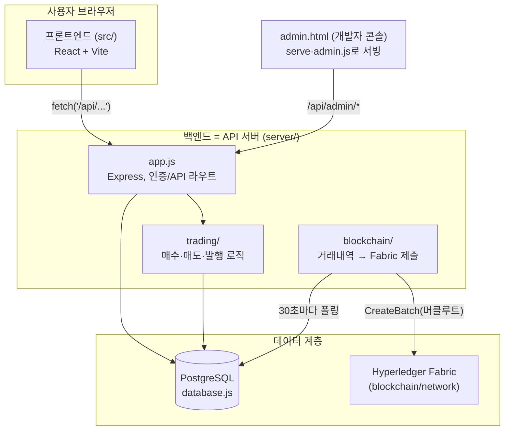
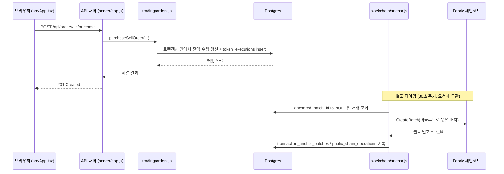
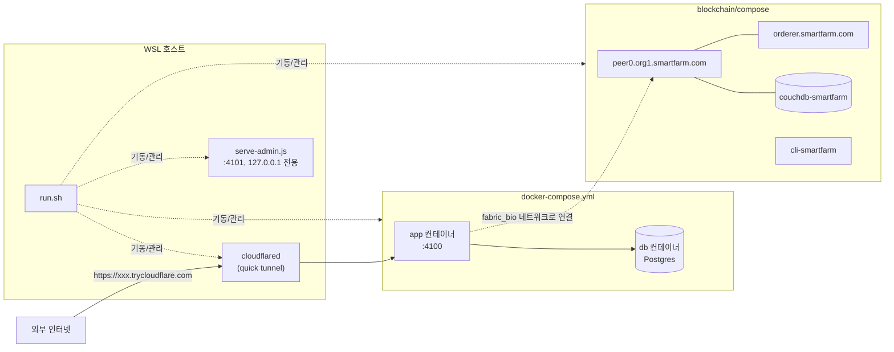

# GREEN LINK 전체 구조

파일 하나하나가 뭘 하는지는 [PROJECT_STRUCTURE.md](./PROJECT_STRUCTURE.md), 실행 방법은
[RUN.md](./RUN.md)를 보면 되고, 이 문서는 "전체가 어떻게 맞물려 있는지" 큰 그림만 정리한다.

## 1. 계층 구조

- **프론트엔드**와 **백엔드(API 서버)**는 완전히 분리된 별도 프로세스다 (`npm run dev:web` / `dev:api`,
  또는 배포 시엔 백엔드가 빌드된 프론트 정적 파일을 같이 서빙).
- **백엔드 = API 서버**: 사용자 눈에 안 보이는 로직(인증, 거래, DB 접근)을 `/api/...` REST
  엔드포인트로 노출한 것. `server/app.js`가 그 진입점이다.
- **거래 원본(source of truth)은 항상 Postgres**다. Fabric은 나중에 "이 시점에 이런 거래들이
  있었다"를 증명하기 위한 앵커링 계층이지, 거래 자체가 체인에서 실행되지 않는다
  (자세한 이유는 아래 5번, 그리고 `DATABASE_BLOCKCHAIN_DESIGN.md`의 역할 분리 원칙 참고).

## 2. 요청 하나가 흐르는 경로 (토큰 구매 예시)

구매 자체는 Postgres 트랜잭션 안에서 즉시(T+0) 끝난다. Fabric 앵커링은 그 뒤에 비동기로
따라붙는 감사 기록일 뿐, 구매 성공 여부에 영향을 주지 않는다.

## 3. 배포 토폴로지 (로컬 / 데모 기준)

- `app`/`db`와 Fabric 네트워크는 **서로 다른 docker-compose 프로젝트**다. `app` 컨테이너가
  Fabric의 `fabric_bio` 네트워크에도 같이 물려서 `peer0.org1.smartfarm.com:7051`로 직접 붙는다
  (`docker-compose.yml`의 `networks: fabric_bio: external: true` 참고).
- `cloudflared`와 `serve-admin.js`는 컨테이너가 아니라 **호스트에서 직접 뜨는 프로세스**다.
  `run.sh`/`stop.sh`가 관리한다.
- 외부에 공개되는 건 `app` 컨테이너 하나뿐이다. DB, Fabric, 관리자 콘솔은 전부 로컬 전용이거나
  내부 네트워크에만 열려 있다.

## 4. 코드 구조 요약

| 영역 | 위치 | 비고 |
| --- | --- | --- |
| 프론트엔드 | `src/` | React + Vite, `api.ts`로 `/api/*` 호출 |
| API 서버 진입점 | `server/index.js`, `server/app.js` | Express, 인증/세션/라우팅 |
| 거래 로직 | `server/trading/` | 주문·체결·발행, `trading-provider.js`는 조립만 |
| 로그인/계정 | `server/account/` | 인증 검증, 파일 기반 계정 로더 |
| DB 스키마·엔진 | `server/database.js` | Postgres 연결, 트랜잭션, 내부 해시체인 |
| 데모 시드 데이터 | `server/seed.js` | 운영 환경(`NODE_ENV=production`)에는 안 들어감 |
| 블록체인 앵커링 | `server/blockchain/` | Fabric Gateway 클라이언트 + 배치 로직 |
| Fabric 네트워크/체인코드 | `blockchain/` | 별도 docker-compose, Go 체인코드(`txanchor`) |
| 개발자 콘솔 | `admin.html`, `serve-admin.js` | 배포 대상 아님, 로컬 전용 |
| 실행 스크립트 | `run.sh`, `stop.sh` | 위 전부를 한 번에 올리고 내림 |

## 5. 왜 이렇게 나눴는가 (설계 원칙)

- **역할 분리**: 농장 운영자(`farms.owner_id`) / 토큰 발행자(`issuer_id`) / 토큰 보유자
  (`token_positions.user_id`)는 서로 다른 개념이다. 관리자라는 이유만으로, 혹은 토큰을 많이
  가졌다는 이유만으로 농장 운영 권한이 생기지 않는다.
- **내부 DB가 원본, 체인은 증빙**: 거래는 Postgres 트랜잭션으로 즉시 확정되고, Fabric은 나중에
  "이 거래들이 이 시점에 이 내용으로 있었다"를 외부에서도 검증 가능하게 만드는 감사 계층이다.
  둘 중 하나가 잠깐 죽어도 다른 쪽은 정상 동작해야 한다 (그래서 앵커링은 실패해도 재시도만 하고
  API 요청 자체를 막지 않는다).
- **개발자 도구는 배포와 분리**: `admin.html`/`serve-admin.js`/`run.sh`/`stop.sh`는 전부
  `dist/`나 Docker 이미지에 들어가지 않는다. 운영 환경에서는 존재 자체를 모르게 한다
  (`NODE_ENV=production`이면 DB 원본 조회 API도 404 처리).
