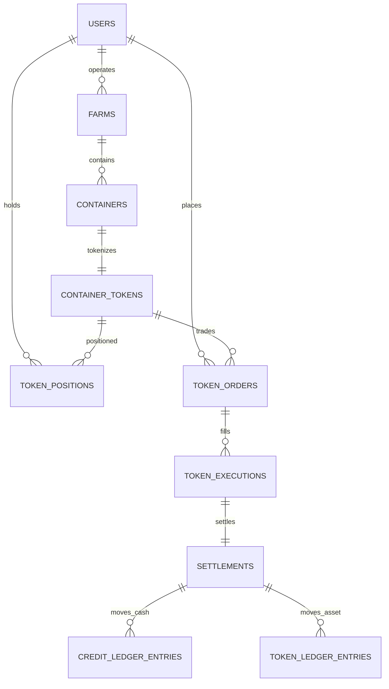

# GREEN LINK 토큰시장 목표 구조

이 문서는 향후 구현할 농장주 발행, 내부 거래 원장과 선택형 블록체인 구조를 정의한다. 현재 실제 테이블은 [docs/DATABASE.md](./docs/DATABASE.md), 현재 API는 [docs/API.md](./docs/API.md)를 기준으로 한다.

## 1. 서비스 모델

- 토큰의 업무상 발행자는 해당 농장의 농장주다.
- 농장주는 자신이 운영하는 농장 컨테이너에 대해서만 발행할 수 있다.
- 컨테이너 한 개에는 토큰 상품 한 개가 연결된다.
- 현재 논의 기준 총발행량은 컨테이너당 10개다.
- 발행된 물량은 먼저 농장주 포지션에 귀속된다.
- 농장주는 보유 물량 일부 또는 전부를 원하는 가격에 판매할 수 있다.
- 구매한 사용자는 자신이 보유한 수량을 다른 가격으로 다시 판매할 수 있다.
- 발행량과 판매가격은 다른 개념이다. 총발행량은 고정해도 시장 판매가격은 주문마다 변할 수 있다.
- 현재 결제는 모의 크레딧이며 실제 원화가 아니다.
- 토큰은 현재 농장 소유권, 증권, 배당권 또는 수익 보장을 의미하지 않는다.

## 2. 구현 반영 현황

| 영역      | 현재 구현                                              | 남은 보강                                      |
| --------- | ------------------------------------------------------ | ---------------------------------------------- |
| 토큰 상품 | `container_tokens`                                     | 상품 약관·상태 변경 workflow 세분화            |
| 발행      | 농장주 신청 → 관리자 승인 → 농장주에게 발행            | 법무 검토와 실서비스 승인 정책                 |
| 보유량    | `token_positions` available/reserved/unsettled/settled | 원장 기반 재계산 배치와 reconciliation         |
| 주문      | 원수량·잔여수량·side를 가진 `token_orders`             | 외부 broker 상태 코드 매핑                     |
| 체결      | 불변 `token_executions`                                | 정정·취소 reversal 이벤트                      |
| 결제      | `settlements` confirmed T+0                            | 실제 PG·외부 정산 비동기 상태                  |
| 금액 기록 | `credit_ledger_entries`와 `users.credit_balance` cache | `credit_accounts` 분리                         |
| 토큰 기록 | `token_ledger_entries`와 `token_positions`             | snapshot/rebuild 운영 도구                     |
| 외부 연동 | `InternalTradingProvider`, `/api/trading/*`            | `BrokerTradingProvider` 실제 adapter와 webhook |

## 3. 핵심 관계



농장 운영자와 토큰 보유자는 별개다.

```text
farms.owner_id            = 농장 운영자
container_tokens.issuer_id = 토큰 발행자
token_positions.user_id    = 현재 토큰 보유자
users.role                 = 시스템 권한
```

관리자라는 이유만으로 농장 운영자나 토큰 소유자가 되지 않는다.

## 4. 목표 테이블

### container_tokens

| 필드                       | 의미                                |
| -------------------------- | ----------------------------------- |
| `id`                       | 내부 토큰 상품 ID                   |
| `container_id`             | 대상 컨테이너, UNIQUE               |
| `issuer_id`                | 농장주                              |
| `symbol`                   | 표시 심볼                           |
| `total_supply`             | 총발행량                            |
| `initial_price`            | 최초 판매 참고가격                  |
| `status`                   | requested/approved/issued/suspended |
| `terms_json`, `terms_hash` | 발행 조건과 조건 해시               |
| `execution_venue`          | INTERNAL/BROKER/PUBLIC_CHAIN        |

`initial_price`는 현재 시장가격이 아니다. 현재가는 최근 체결 또는 공개 주문에서 계산한다.

### token_positions

| 필드                  | 의미                    |
| --------------------- | ----------------------- |
| `user_id`, `token_id` | 사용자·토큰 복합키      |
| `available_quantity`  | 새 판매·이전 가능 수량  |
| `reserved_quantity`   | 판매 주문에 예약된 수량 |
| `unsettled_quantity`  | 체결됐지만 결제 전 수량 |
| `settled_quantity`    | 결제 완료 기준 수량     |

position은 빠른 조회용 현재 상태다. 최종 증감 근거는 token ledger다.

### token_orders

| 필드                 | 의미                                                    |
| -------------------- | ------------------------------------------------------- |
| `id`                 | 내부 주문 ID                                            |
| `user_id`            | 주문 사용자                                             |
| `token_id`           | 대상 토큰                                               |
| `side`               | BUY/SELL                                                |
| `order_type`         | MARKET/LIMIT                                            |
| `limit_price`        | 지정 가격                                               |
| `original_quantity`  | 최초 주문 수량                                          |
| `remaining_quantity` | 미체결 수량, 0 허용                                     |
| `status`             | pending/open/partially_filled/filled/cancelled/rejected |
| `execution_venue`    | 내부·외부 실행 장소                                     |
| `external_order_id`  | 외부 주문번호                                           |
| `idempotency_key`    | 재요청 중복 방지                                        |

주문은 상태가 변한다. 수정 이력은 audit/event로 남긴다.

### token_executions

| 필드                            | 의미                |
| ------------------------------- | ------------------- |
| `id`                            | 내부 체결 ID        |
| `buy_order_id`, `sell_order_id` | 양쪽 주문           |
| `buyer_id`, `seller_id`         | 양쪽 사용자         |
| `token_id`                      | 대상 토큰           |
| `quantity`, `unit_price`        | 체결 수량·가격      |
| `external_execution_id`         | 외부 체결번호, 선택 |
| `executed_at`                   | 체결 시각           |

체결은 append-only다. 정정은 기존 행을 덮어쓰지 않고 correction/reversal 이벤트를 추가한다.

### settlements

| 필드                     | 의미                              |
| ------------------------ | --------------------------------- |
| `execution_id`           | 대상 체결                         |
| `cash_status`            | 금액 이전 상태                    |
| `asset_status`           | 토큰 이전 상태                    |
| `status`                 | pending/confirmed/failed/reversed |
| `external_settlement_id` | 외부 결제번호                     |
| `settled_at`             | 완료 시각                         |

내부 모의 거래는 초기에는 체결과 결제를 한 DB 트랜잭션에서 T+0으로 완료한다. 외부 결제와 퍼블릭 체인은 비동기 상태를 사용한다.

### credit_ledger_entries / token_ledger_entries

모든 증감은 원인 ID와 함께 불변 행으로 기록한다.

```text
entry_id
account_or_position_id
direction              DEBIT / CREDIT
amount_or_quantity
reason                 ISSUE / RESERVE / RELEASE / PURCHASE / SALE / REFUND
execution_id
settlement_id
created_at
```

한 거래의 차변과 대변 합계가 일치해야 한다. 화면 잔액과 포지션은 원장으로 재계산할 수 있어야 한다.

## 5. 농장주 발행 흐름

```text
농장주 로그인
→ 자기 농장·컨테이너 선택
→ 발행량·초기가격·조건 입력
→ 소유권과 중복 발행 검사
→ container_tokens requested 생성
→ 승인 절차가 있으면 approved
→ ISSUE token ledger 기록
→ 농장주 token_position에 10개 반영
→ 상태 issued
```

관리자 직접 수량 설정 API도 내부적으로 같은 승인 흐름을 사용한다. 관리자는 조건을 확인하거나 중지할 수 있지만 발행 물량의 소유자가 되지 않는다.

## 6. 최초 판매와 재판매

### 최초 판매

```text
농장주 보유 10개
→ 3개 판매 주문
→ available 10 → 7
→ reserved 0 → 3
→ SELL order open
```

### 사용자 구매

```text
구매 주문 접수
→ 모의 잔액과 매도 잔여량 확인
→ execution 생성
→ 구매자·판매자 credit ledger
→ 판매자·구매자 token ledger
→ position 갱신
→ 매도 주문 remaining 감소
→ 0이면 filled
→ settlement confirmed
```

### 사용자 재판매

구매자의 결제 완료 수량만 판매할 수 있다. 판매 등록 시 available에서 reserved로 이동하며, 취소 시 남은 수량을 available로 되돌린다.

## 7. 가격

가격은 토큰 자체의 고정 필드 하나로 관리하지 않는다.

```text
최초 참고가격 = container_tokens.initial_price
최저 매도가   = open SELL 주문의 MIN(limit_price)
최고 매수가   = open BUY 주문의 MAX(limit_price)
최근 체결가   = 가장 최근 execution.unit_price
기간 평균가   = execution의 수량 가중평균
```

판매자가 가격을 바꾸면 기존 주문을 취소하고 새 주문을 생성하는 방식이 이력을 보존하기 쉽다.

## 8. 동시 구매와 재요청

마지막 수량의 중복 구매를 막기 위해 조건부 UPDATE를 사용한다.

```sql
UPDATE token_orders
SET remaining_quantity = remaining_quantity - :quantity,
    status = CASE
      WHEN remaining_quantity - :quantity = 0 THEN 'filled'
      ELSE 'partially_filled'
    END,
    updated_at = :now
WHERE id = :order_id
  AND status IN ('open', 'partially_filled')
  AND remaining_quantity >= :quantity;
```

변경 행이 정확히 1개일 때만 execution과 ledger를 기록한다. 전체 처리는 같은 DB 트랜잭션에서 수행한다.

네트워크 재전송은 사용자·요청 종류·`idempotency_key` UNIQUE 제약으로 같은 결과를 반환한다.

## 9. 내부 DB와 외부 증권사

현재는 `InternalTradingProvider`가 DB를 원본으로 사용한다. 외부 연동 후에는 `BrokerTradingProvider`가 외부 주문·체결을 호출하고 우리 DB는 external ID 매핑과 조회 projection을 저장한다.

```text
INTERNAL     → DB 주문·체결·원장이 원본
BROKER       → 외부 주문·체결·포지션이 원본
PUBLIC_CHAIN → 확정 event와 balanceOf가 체인 자산 원본
```

DB를 외부 업체에 직접 공개하지 않는다. 상세 연동 계약은 [docs/EXTERNAL_TRADING.md](./docs/EXTERNAL_TRADING.md)를 따른다.

## 10. 블록체인 경계

### 내부 DB 단계

- 주문, 체결, 모의 잔액, 토큰 보유량의 원본은 DB다.
- HMAC 사설 원장은 감사용이다.

### 퍼블릭 체인 단계

- ERC-1155 발행·이전·잔액은 확정된 체인 이벤트가 원본이다.
- DB는 outbox와 조회 projection을 보관한다.
- 개인정보, 센서 원본, 개인키는 체인에 기록하지 않는다.
- DB 저장과 체인 제출을 동시에 성공했다고 가정하지 않고 outbox로 연결한다.

퍼블릭 체인 운영 상세는 [docs/PUBLIC_CHAIN.md](./docs/PUBLIC_CHAIN.md)를 따른다.

## 11. 구현 순서

1. 현재 내부 구매·판매 안정화 완료
2. 농장주 발행자와 초기 보유량 원장 구현 완료
3. order 원수량·잔여수량·예약수량 분리 완료
4. execution과 settlement 분리 완료
5. 크레딧·토큰 불변 ledger 구현 완료
6. idempotency와 조건부 체결 적용 완료
7. `InternalTradingProvider`로 기존 SQL 캡슐화 완료
8. API·provider contract test 작성 완료
9. 필요할 때 외부 sandbox adapter 구현
10. 법률·상품성 검토 후 실제 외부 또는 퍼블릭 체인 연동

현재는 내부 구현 범위가 완료됐고, 외부 연동이나 별도 DB보다 먼저 법률·상품성 검토와 운영 reconciliation 설계를 확정해야 한다.
