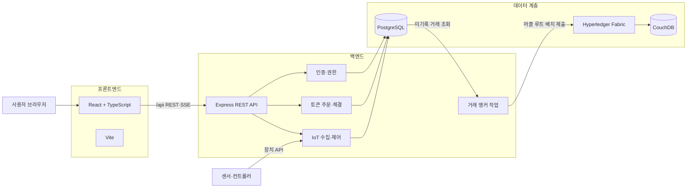
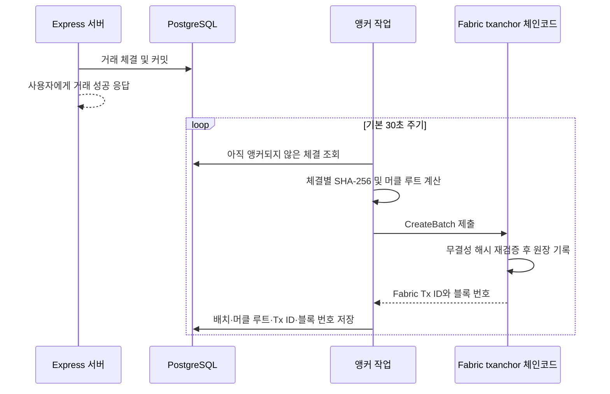

# GREEN LINK 스마트팜 프로젝트 개요

## 1. 프로젝트 소개

**GREEN LINK**는 스마트팜의 재배 환경을 원격으로 확인·제어하고, 농장 컨테이너를 기반으로
발행한 참여 토큰을 사용자끼리 거래할 수 있게 만든 웹 기반 데모 플랫폼이다.

이 프로젝트는 크게 다음 세 가지 기능을 하나의 서비스로 묶는다.

1. **스마트팜 운영**: 농장과 재배 컨테이너를 등록하고 온도, 습도, 조도, CO₂, 토양 수분,
   pH, EC 데이터를 모니터링한다.
2. **참여 토큰 거래**: 컨테이너별 토큰을 발행하고 내부 거래소에서 모의 크레딧으로
   사고팔며 보유 자산과 거래 내역을 관리한다.
3. **거래 증빙**: 실제 거래 처리는 PostgreSQL에서 수행하고, 완료된 거래를 묶은 머클 루트를
   Hyperledger Fabric에 기록해 사후 위·변조 여부를 검증할 수 있게 한다.

> 현재 프로젝트는 실제 금융·투자 서비스가 아닌 **개발 및 시연용 시스템**이다. 토큰은 농장
> 소유권, 증권, 배당권 또는 수익 보장을 의미하지 않으며 결제에도 실제 원화가 아닌 모의
> 크레딧을 사용한다.

## 2. 주요 사용자와 기능

| 사용자 | 주요 기능 |
| --- | --- |
| 일반 사용자 | 회원가입·로그인, 농장 지도 및 컨테이너 조회, 센서/CCTV 확인, 토큰 구매·판매, 지갑 및 거래 내역 조회 |
| 농장 운영자 | 본인 농장과 컨테이너 확인, 실시간 환경 모니터링, 환경 제어 명령 전송, 토큰 발행 요청 |
| 관리자 | 농장·컨테이너 등록, 토큰 발행 승인, IoT 장치와 카메라 설정, 사용자·세션·감사 로그·원장 조회 |
| IoT 장치 | 장치 API 키로 센서 측정값 전송, 대기 중인 제어 명령 수신 및 처리 결과 응답 |

농장 운영 권한과 토큰 보유 권한은 서로 분리된다. 토큰을 보유했다고 해서 해당 농장을
제어할 수 있는 것은 아니며, 농장의 `owner_id`로 지정된 사용자만 운영 권한을 가진다.

## 3. 제공 화면

- **대시보드**: 모의 크레딧, 보유 토큰, 자산 평가액, 최근 거래, 농장 현황 및 알림 요약
- **농장 지도**: Leaflet 기반 지도에서 등록된 농장 위치와 상태 확인
- **내 농장**: 운영 중인 농장과 투자·보유 중인 컨테이너 구분 조회
- **농장/컨테이너 상세**: 작물과 재배 일정, 실시간 센서, 랙 정보, HLS CCTV 영상 확인
- **환경 제어**: 운영자가 컨트롤러에 냉난방·환기 등 제어 명령 전송
- **거래소**: 판매 주문 검색, 수량 선택 및 토큰 구매
- **내 지갑**: 보유·예약·미결제·결제완료 수량, 판매 등록, 주문 취소, 거래 내역 확인
- **관리자 화면**: 농장/컨테이너 등록, 토큰 발행, IoT 장치·카메라·감사 원장 관리
- **개발자 콘솔**: `admin.html`에서 DB 원본, 계정, 세션, 거래 및 Fabric 앵커 결과 확인

## 4. 전체 시스템 구조



### 구성 요소별 역할

| 계층 | 기술 | 역할 |
| --- | --- | --- |
| 프론트엔드 | React, TypeScript, Vite | 사용자 화면, API 호출, 센서 실시간 갱신, 지도 및 HLS 영상 표시 |
| API 서버 | Node.js, Express | 인증, 권한 검사, 농장·거래·IoT·관리 API 제공 |
| 서비스 DB | PostgreSQL | 사용자, 농장, 센서, 주문, 체결, 잔액 및 감사 기록의 원본 저장소 |
| 내부 감사 원장 | PostgreSQL 해시 체인 | 센서 이벤트와 제어 결과 등 주요 이벤트의 연속성 검증 |
| 외부 증빙 원장 | Hyperledger Fabric, Go 체인코드 | 완료된 토큰 거래를 머클 트리 배치로 기록 |
| Fabric 상태 DB | CouchDB | Fabric 체인코드의 월드 스테이트 저장 및 조회 |
| 실행 환경 | Docker Compose, Cloudflare Tunnel | 앱·DB·Fabric 실행 및 데모용 외부 접속 주소 제공 |

## 5. 핵심 처리 흐름

### 5.1 센서 데이터와 실시간 모니터링

1. 관리자가 컨테이너에 센서 장치를 등록하고 장치 API 키를 발급한다.
2. 센서가 `POST /api/iot/ingest/sensors`로 측정값을 전송한다.
3. 서버가 최신 측정값과 센서 이벤트를 PostgreSQL에 저장하고 내부 감사 원장에 기록한다.
4. 서버는 SSE(Server-Sent Events) 채널로 접속 중인 브라우저에 변경 사항을 전송한다.
5. 컨테이너 상세 화면이 새 측정값을 별도 새로고침 없이 반영한다.

### 5.2 환경 제어

1. 권한이 있는 농장 운영자가 컨테이너 화면에서 제어 명령을 요청한다.
2. 서버가 명령을 `queued` 상태로 PostgreSQL에 저장한다.
3. 컨트롤러 장치가 자신의 대기 명령을 조회해 실제 장비에 적용한다.
4. 장치가 성공 또는 실패 결과를 응답하면 서버가 결과를 저장하고 브라우저에 실시간 전달한다.

### 5.3 토큰 발행과 거래

1. 농장 운영자가 컨테이너의 토큰 심볼, 총 발행량, 초기 가격을 입력해 발행을 요청한다.
2. 관리자가 요청을 검토하고 발행을 승인한다.
3. 보유자가 판매 주문을 등록하면 해당 수량은 판매용으로 예약된다.
4. 구매자가 주문을 선택하면 서버가 하나의 PostgreSQL 트랜잭션 안에서 잔액 차감, 보유 수량
   이전, 주문 수량 변경, 체결 및 원장 기록을 함께 처리한다.
5. 같은 요청이 중복 처리되지 않도록 멱등 키를 사용한다.

### 5.4 Fabric 거래 앵커링



PostgreSQL이 서비스 데이터의 **원본(source of truth)**이고 Fabric은 거래 내용을 나중에
검증하기 위한 증빙 계층이다. 따라서 Fabric 연결이 일시적으로 실패해도 이미 완료된 거래를
취소하지 않으며, 앵커 작업에서 다시 시도할 수 있다.

## 6. 디렉터리 구조

```text
smartfarm/
├── src/                         # React 프론트엔드
│   ├── App.tsx                  # 화면 구성과 주요 사용자 기능
│   ├── api.ts                   # REST API 및 인증 토큰 처리
│   ├── model.ts                 # 프론트엔드 데이터 타입
│   ├── tradingLimits.ts         # 클라이언트 거래 제한값
│   ├── components/
│   │   ├── AdminOperations.tsx  # 관리자 운영·감사 UI
│   │   ├── HlsVideo.tsx         # HLS CCTV 재생
│   │   └── LiveMap.tsx          # Leaflet 농장 지도
│   └── styles/app.css           # 전체 화면 스타일
├── server/                      # Express 백엔드
│   ├── index.js                 # 서버 시작, 정적 파일 제공, 앵커 주기 실행
│   ├── app.js                   # API 라우트와 인증·권한 미들웨어
│   ├── database.js              # PostgreSQL 스키마와 DB 접근 계층
│   ├── seed.js                  # 개발용 계정·농장·거래 데이터
│   ├── account/                 # 로그인 계정 로딩과 인증
│   ├── trading/                 # 발행, 주문, 체결, 포지션 및 원장 로직
│   └── blockchain/              # Fabric Gateway 연결과 앵커 배치 처리
├── blockchain/                  # Hyperledger Fabric 네트워크
│   ├── chaincode/main.go        # txanchor Go 체인코드
│   ├── compose/                 # Orderer, Peer, CouchDB, CLI 구성
│   └── *.sh                     # 네트워크 생성·채널 참가·배포·점검 스크립트
├── public/                      # 앱 아이콘, CCTV 대체 이미지 등 정적 파일
├── admin.html                   # 로컬 개발자용 관리 콘솔
├── serve-admin.js               # 관리 콘솔 전용 로컬 서버
├── docker-compose.yml           # 앱과 PostgreSQL 실행 구성
├── Dockerfile                   # 프론트 빌드 + API 운영 이미지
├── run.sh / stop.sh             # 전체 데모 환경 시작·종료
├── ARCHITECTURE.md              # 세부 아키텍처 설명
├── PROJECT_STRUCTURE.md         # 파일별 역할 설명
└── RUN.md                       # 실행 및 문제 해결 가이드
```

`blockchain/chaincode/vendor/`, `blockchain/bin/`, 인증서와 채널 산출물은 Fabric 실행에 필요한
의존성·바이너리·네트워크 생성 파일이며 일반 애플리케이션 기능을 수정할 때는 보통 건드리지 않는다.

## 7. 주요 데이터 모델

| 영역 | 대표 테이블 | 저장 내용 |
| --- | --- | --- |
| 계정 | `users`, `sessions`, `audit_logs` | 사용자, 역할, 모의 크레딧, 로그인 세션, 관리자 활동 |
| 스마트팜 | `farms`, `containers`, `container_page_content` | 농장 위치와 소유자, 컨테이너 및 작물 정보, 화면 콘텐츠 |
| IoT | `iot_devices`, `sensor_readings`, `sensor_events`, `control_commands`, `camera_streams` | 장치, 최신 센서값, 센서 이력, 제어 명령, HLS 주소 |
| 토큰 | `container_tokens`, `token_positions` | 발행 조건과 상태, 사용자별 가용·예약·미결제·결제완료 수량 |
| 거래 | `orders`, `token_orders`, `token_executions`, `settlements` | 판매 주문, 표준 주문, 체결, 결제 상태 |
| 회계 원장 | `credit_ledger_entries`, `token_ledger_entries` | 크레딧과 토큰의 차변·대변 변경 기록 |
| 무결성 | `blockchain_blocks`, `transaction_anchor_batches`, `public_chain_operations` | 내부 해시 체인, Fabric 배치와 제출 결과 |

## 8. 주요 API 영역

| 경로 | 설명 |
| --- | --- |
| `/api/auth/*`, `/api/me` | 회원가입, 로그인·로그아웃, 프로필과 비밀번호 변경 |
| `/api/farms`, `/api/containers/*` | 농장·컨테이너·센서·카메라 조회 및 실시간 연결 |
| `/api/orders/*`, `/api/trading/*` | 판매 주문, 구매, 주문장, 시세, 포지션 및 체결 조회 |
| `/api/wallet`, `/api/dashboard` | 자산·보유 내역과 대시보드 요약 |
| `/api/iot/*` | 센서 수집, 컨트롤러 명령 조회와 처리 응답 |
| `/api/ledger/*` | 내부 감사 원장 검증 및 블록 조회 |
| `/api/admin/*` | 사용자, 농장, 컨테이너, 토큰, 장치, 감사 및 앵커 관리 |

사용자 API는 세션 토큰으로 인증하고, IoT API는 장치별 API 키로 인증한다. 관리자 API는
로그인뿐 아니라 `admin` 역할 검사도 통과해야 한다.

## 9. 기술 스택

- **프론트엔드**: React, TypeScript, Vite, Leaflet/React Leaflet, HLS.js, Lucide React
- **백엔드**: Node.js 22 이상, Express 5, node-postgres(`pg`)
- **보안·검증**: Helmet, 요청 속도 제한, scrypt 비밀번호 해시, 세션 토큰 해시 저장,
  HMAC 기반 내부 원장 서명, SHA-256 머클 트리
- **블록체인**: Hyperledger Fabric Gateway, Fabric Peer/Orderer, CouchDB, Go 체인코드
- **개발·검사**: TypeScript, ESLint, Prettier, Vitest, Supertest
- **배포·실행**: Docker, Docker Compose, Cloudflare Quick Tunnel

## 10. 실행 방법

### 전체 데모 실행

Docker와 `cloudflared`가 준비된 환경에서는 다음 명령으로 Fabric, 앱, PostgreSQL, 임시 외부
터널과 관리 콘솔을 함께 실행한다.

```bash
./run.sh
```

- 서비스: `http://localhost:4100`
- 관리자 콘솔: `http://localhost:4101`
- 종료: `./stop.sh`

자세한 초기 설정과 장애 해결 방법은 [RUN.md](./RUN.md)를 참고한다.

### 로컬 개발 실행

PostgreSQL 접속 문자열을 `DATABASE_URL`로 설정한 뒤 다음 명령을 사용한다.

```bash
npm install
npm run dev
```

- Vite 개발 서버: `http://localhost:5177`
- Express API 서버: `http://localhost:4100`
- Vite는 `/api` 요청을 Express 서버로 프록시한다.
- 로컬 개발에서는 `ENABLE_CHAIN_ANCHOR=true`를 설정한 경우에만 Fabric 앵커 작업이 실행된다.

### 품질 검사

```bash
npm run check
```

위 명령은 린트, TypeScript 검사, API 테스트와 프론트엔드 빌드를 순서대로 수행한다.

## 11. 현재 단계와 주의 사항

- 데모 계정과 샘플 농장 데이터는 개발 환경에서 자동으로 생성된다.
- 결제 제공자는 `mock`이며 실제 은행, 카드 또는 원화 결제와 연결되지 않는다.
- Cloudflare Quick Tunnel 주소는 실행할 때마다 달라질 수 있다.
- `admin.html`은 개발자 도구이며 운영용 프론트엔드나 Docker 이미지에 포함되지 않는다.
- 개발자 콘솔에는 데모 관리자 정보가 노출될 수 있으므로 외부 주소를 불특정 사용자에게
  공유하면 안 된다.
- 운영 환경에서는 충분히 긴 `LEDGER_SIGNING_KEY`, 안전한 DB 비밀번호, HTTPS, 영구 도메인,
  비밀정보 관리 및 접근 통제 정책을 별도로 구성해야 한다.
- Fabric 네트워크의 볼륨을 삭제하면 기존 블록체인 기록을 복구할 수 없으므로
  `docker compose down -v` 사용에 주의해야 한다.

## 12. 한 줄 요약

GREEN LINK는 **스마트팜 IoT 모니터링·제어**, **컨테이너 참여 토큰의 모의 거래**, 그리고
**Hyperledger Fabric 기반 거래 무결성 증빙**을 결합한 풀스택 스마트팜 데모 프로젝트다.
