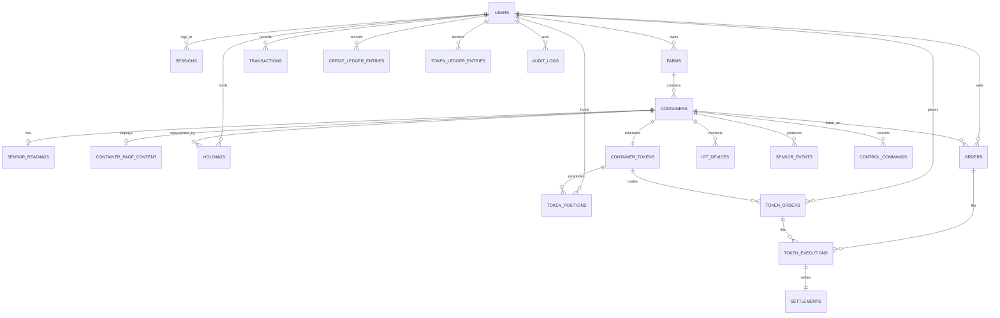

# GREEN LINK 현재 DB 구조

이 문서는 목표 설계가 아니라 현재 `server/database.js`와 migration 10 기준의 SQLite 구조를 설명한다.

## 1. 실행 방식

```text
DB 엔진: Node.js built-in SQLite
기본 파일: server/data/smartfarm.sqlite
외래키: ON
저널: WAL
busy timeout: 5초
현재 migration: 10
```

SQLite는 별도 프로세스로 실행하지 않는다. API가 시작될 때 DB 파일을 열고 스키마와 migration을 적용한다.

## 2. 전체 관계



## 3. 테이블 그룹

### 시스템

| 테이블              | 역할           |
| ------------------- | -------------- |
| `schema_migrations` | 적용된 DB 버전 |

### 사용자·인증

| 테이블              | 역할                                           | 중요 필드                                                    |
| ------------------- | ---------------------------------------------- | ------------------------------------------------------------ |
| `users`             | 계정, 역할, 상태, 프로필, 모의 잔액, 연결 지갑 | `email`, `password_hash`, `role`, `status`, `credit_balance` |
| `sessions`          | 로그인 세션 해시와 만료                        | `token_hash`, `user_id`, `expires_at`                        |
| `wallet_challenges` | EVM 지갑 연결용 일회성 nonce                   | `user_id`, `message`, `expires_at`                           |

`users.email`은 대소문자를 구분하지 않고 유일하다. 신규 비밀번호는 scrypt 해시만 저장하며 원문 세션 토큰은 저장하지 않는다.

### 농장·콘텐츠

| 테이블                   | 역할                             | 관계                           |
| ------------------------ | -------------------------------- | ------------------------------ |
| `farms`                  | 농장 기본 정보와 지도 좌표       | `owner_id → users.id`          |
| `containers`             | 재배 컨테이너와 현재 토큰 표시값 | `farm_id → farms.id`           |
| `container_page_content` | 컨테이너 상세의 랙 문구 JSON     | `container_id → containers.id` |

현재 `containers`에는 화면 호환용 `token_id`, 총발행량, 판매 가능량, 표시 가격 컬럼이 남아 있고, 발행자·초기 가격·상태·조건은 `container_tokens`가 원본이다.

### 내부 거래

| 테이블                  | 현재 역할                                                  | 중요 제약                            |
| ----------------------- | ---------------------------------------------------------- | ------------------------------------ |
| `container_tokens`      | 컨테이너별 토큰 상품, 발행자, 초기 참고가                  | 컨테이너당 1개 UNIQUE                |
| `token_positions`       | 사용자별 available/reserved/unsettled/settled 현재 상태    | 사용자·토큰 복합키                   |
| `token_orders`          | BUY/SELL 주문의 원수량·잔여수량·상태                       | legacy 주문과 1:1 매핑 가능          |
| `holdings`              | 사용자별 토큰 보유량과 평균단가                            | 사용자·토큰 조합 UNIQUE, 수량 0 이상 |
| `orders`                | 공개 매도 주문의 원수량·남은 수량과 가격                   | 수량 0 이상, 가격 양수               |
| `token_executions`      | 실제 체결된 가격·수량                                      | append-only                          |
| `settlements`           | 내부 모의 결제와 토큰 이전 완료 상태                       | 체결당 1개                           |
| `credit_ledger_entries` | 모의 크레딧 증감 근거                                      | append-only                          |
| `token_ledger_entries`  | available/reserved/unsettled/settled 버킷별 토큰 증감 근거 | append-only                          |
| `idempotency_keys`      | 같은 구매·판매 요청 재전송 방지                            | 사용자·범위·키 복합키                |
| `transactions`          | 사용자의 구매·판매 표시 내역                               | 수량·가격 양수                       |

현재 의미:

```text
holdings.quantity = 판매 주문에 예약되지 않은 사용 가능 수량
orders.original_quantity = 판매 등록 당시 원수량
orders.quantity = 해당 판매 주문의 남은 예약 수량
orders.status = 판매중 / 거래완료 / 취소
token_positions.available_quantity = 새 판매 주문에 쓸 수 있는 수량
token_positions.reserved_quantity = 공개 매도 주문에 묶인 수량
token_positions.settled_quantity = 내부 결제가 확정된 현재 소유 수량
```

판매 등록 시 `holdings.quantity`와 `token_positions.available_quantity`를 줄이고 `orders.quantity`, `token_orders.remaining_quantity`, `token_positions.reserved_quantity`에 예약한다. 취소하면 남은 주문 수량을 holding과 available position으로 되돌린다. 마지막 수량 체결은 `orders.quantity=0`, `status=거래완료`, `token_orders.status=filled`다.

신규 발행은 `container_tokens`에 발행 상품을 만들고, 발행 물량을 관리자가 아니라 해당 농장 운영자의 `holdings`, `token_positions`, `token_ledger_entries(reason=ISSUE)`에 기록한다.

### 감사·내부 원장

| 테이블              | 역할                                        |
| ------------------- | ------------------------------------------- |
| `audit_logs`        | 누가 어떤 엔티티에 어떤 작업을 했는지 기록  |
| `blockchain_blocks` | 이전 해시와 HMAC 서명을 가진 사설 감사 체인 |

사설 원장은 위변조 확인용이며 분산 블록체인이나 법적 증권 원장이 아니다.

### IoT

| 테이블             | 역할                                 |
| ------------------ | ------------------------------------ |
| `iot_devices`      | 장비 유형, 해시된 장비 키, 연결 상태 |
| `sensor_readings`  | 컨테이너별 최신 센서값과 짧은 이력   |
| `sensor_events`    | 센서 원본 이벤트                     |
| `control_commands` | 환경 제어 요청과 ACK 상태            |
| `camera_streams`   | 브라우저용 HLS URL과 상태            |

### 퍼블릭 체인 보조 데이터

| 테이블                    | 역할                           |
| ------------------------- | ------------------------------ |
| `public_chain_operations` | 체인 제출 outbox와 재시도 상태 |
| `sensor_anchor_batches`   | 센서 이벤트 구간과 Merkle root |

## 4. 구매 트랜잭션

현재 구매는 한 DB 트랜잭션에서 처리된다.

```text
BEGIN IMMEDIATE
  주문 조회와 남은 수량 검사
  조건부 UPDATE로 주문 남은 수량 감소
  canonical token_order 상태 갱신
  구매자 잔액 검사·차감
  판매자 잔액 증가
  구매자 holding 추가·갱신
  구매자·판매자 token_position 갱신
  token_executions 생성
  settlements confirmed 생성
  credit/token ledger 기록
  transaction 추가
  사설 원장과 audit log 추가
COMMIT
```

중간 SQL이 실패하면 전부 `ROLLBACK`된다. migration 8부터 완료 주문의 남은 수량 0을 정상 허용하고, migration 10부터 canonical `token_orders`와 `token_positions`를 함께 갱신한다.
같은 idempotency key가 다시 들어오면 처음 저장한 응답을 반환하고 DB 수량·잔액은 다시 변경하지 않는다.

## 5. 현재 원본 데이터

| 운영 모드          | 원본(source of truth)                                                                                                                    |
| ------------------ | ---------------------------------------------------------------------------------------------------------------------------------------- |
| 내부 모의 거래     | SQLite `token_orders`, `token_positions`, `orders`, `holdings`, `token_executions`, `settlements`, ledger tables, `users.credit_balance` |
| HMAC 사설 감사     | SQLite `blockchain_blocks`                                                                                                               |
| 퍼블릭 체인 비활성 | SQLite만 사용                                                                                                                            |
| 퍼블릭 체인 활성   | 온체인 잔액·확정 이벤트가 체인 자산 원본, SQLite는 projection/outbox                                                                     |
| 향후 증권사 연동   | 외부 주문·체결·포지션이 원본, SQLite는 로컬 매핑·조회 projection                                                                         |

하나의 자산에 내부 모드와 외부 모드를 동시에 적용하지 않는다. 현재 기본 `execution_venue`는 `INTERNAL`이다.

## 6. 현재 구조에서 부족한 것

### 거래 모델

- `orders`와 `holdings`는 기존 화면 호환 projection으로 남아 있으며, 정식 주문·포지션은 `token_orders`와 `token_positions`가 기준이다.
- `transactions`는 화면용 최근 내역이고, 정식 근거는 `token_executions`, `settlements`, ledger table에 둔다.
- 모의 잔액은 ledger를 기록하지만 조회 성능을 위해 `users.credit_balance` 캐시도 함께 유지한다.

### 데이터 운영

- SQLite는 한 파일에서 동시에 한 writer만 처리한다.
- 대량 센서 이벤트와 거래 원장이 같은 파일에 있다.
- migration 파일이 버전별 파일이 아니라 `database.js`에 누적돼 있다.
- 운영 백업·복구 검증과 보존 정책을 자동화해야 한다.

## 7. 다음 보강 테이블

핵심 내부 거래 테이블은 구현됐다. 다음 보강 대상은 외부 결제·브로커 연동을 위한 계정과 outbox다.

```text
credit_accounts
integration_outbox
external_accounts
external_order_events
reconciliation_runs
```

핵심 구분:

```text
order      = 사용자의 주문 의사와 변경되는 상태
execution  = 실제 체결된 가격·수량의 불변 기록
settlement = 금액·토큰 이전 완료 상태
ledger     = 모든 증감의 불변 근거
position   = 원장에서 계산한 available/reserved/settled 현재 상태
```

## 8. DB 분리 기준

현재는 여러 SQLite 파일로 나누지 않는다. 주문·체결·잔액·보유량을 한 트랜잭션으로 유지하는 편이 안전하다.

다음 조건이 생기면 PostgreSQL 같은 client/server DB로 먼저 이전한다.

- API 인스턴스가 여러 대가 됨
- 동시 구매로 write lock 대기가 반복됨
- 독립적인 장애 격리·배포가 필요함
- 센서·시세 데이터량과 보존 정책이 거래 원장과 크게 달라짐

PostgreSQL 이전 초기에는 DB를 여러 개 만들기보다 `identity`, `asset`, `trading`, `ledger`, `operations` schema로 논리 분리한다. 주문·체결·금액·보유 원장은 정합성이 확립될 때까지 같은 트랜잭션 DB에 둔다.
